# 📐 UML — Unified Modeling Language

## Summary

This document covers UML (Unified Modeling Language) for visualizing software system design. Topics include use case diagrams for capturing requirements, class diagrams for object-oriented design, entity-relationship diagrams (ERD) for database modeling, sequence diagrams for showing interactions between components, and best practices for creating effective UML diagrams using tools like Mermaid.

## Sommaire

- [📊 UML Overview Diagram](#📊-uml-overview-diagram)
- [1. Introduction to UML](#1-introduction-to-uml)
  - [Definition](#definition)
  - [Why Model Before You Code?](#why-model-before-you-code)
  - [UML Tools](#uml-tools)
  - [UML in Practice](#uml-in-practice)
- [2. Use Case Diagrams](#2-use-case-diagrams)
  - [Definition](#definition)
  - [Elements](#elements)
  - [Include vs Extend](#include-vs-extend)
  - [Practical Example — E-Commerce System](#practical-example-—-e-commerce-system)
  - [Mermaid Syntax](#mermaid-syntax)
  - [Common Mistakes](#common-mistakes)
- [3. Class Diagrams](#3-class-diagrams)
  - [Definition](#definition)
  - [Class Notation](#class-notation)
  - [Relationships](#relationships)
  - [Relationship Types Reference](#relationship-types-reference)
  - [Multiplicity / Cardinality](#multiplicity-/-cardinality)
  - [Practical Example — Blog System](#practical-example-—-blog-system)
  - [Mermaid Class Diagram](#mermaid-class-diagram)
  - [Mapping to PHP Code](#mapping-to-php-code)
  - [Common Mistakes](#common-mistakes)
- [4. Entity-Relationship Diagrams (ERD)](#4-entity-relationship-diagrams-erd)
  - [Definition](#definition)
  - [ERD vs Class Diagram](#erd-vs-class-diagram)
  - [Crow's Foot Notation](#crow's-foot-notation)
  - [Attribute Types](#attribute-types)
  - [Practical Example — E-Commerce ERD](#practical-example-—-e-commerce-erd)
  - [Mermaid ERD](#mermaid-erd)
  - [Mapping ERD to SQL](#mapping-erd-to-sql)
  - [Mapping ERD to Laravel Migrations](#mapping-erd-to-laravel-migrations)
  - [Normalization Quick Reference](#normalization-quick-reference)
  - [Common ERD Mistakes](#common-erd-mistakes)
- [5. Sequence Diagrams](#5-sequence-diagrams)
  - [Definition](#definition)
  - [Elements](#elements)
  - [Practical Example — User Login Flow](#practical-example-—-user-login-flow)
  - [Mermaid Sequence Diagram](#mermaid-sequence-diagram)
  - [Common Use Cases for Sequence Diagrams](#common-use-cases-for-sequence-diagrams)
- [6. UML Best Practices](#6-uml-best-practices)
  - [Definition](#definition)
  - [General Guidelines](#general-guidelines)
  - [Choosing the Right Diagram](#choosing-the-right-diagram)
  - [Mermaid Quick Reference](#mermaid-quick-reference)
  - [DO's ✅ and DON'Ts ❌](#do's-✅-and-don'ts-❌)
- [🔑 Key Takeaways](#🔑-key-takeaways)


> UML (Unified Modeling Language) is a standardized visual language for modeling software systems. It provides a common vocabulary of diagrams to communicate design, structure, and behavior across teams.

---

## 📊 UML Overview Diagram

```
┌─────────────────────────────────────────────────────────────────────┐
│                    UML DIAGRAM TYPES                                │
├──────────────────────────────┬──────────────────────────────────────┤
│    STRUCTURAL DIAGRAMS       │      BEHAVIORAL DIAGRAMS             │
│  (What the system IS)        │    (What the system DOES)            │
├──────────────────────────────┼──────────────────────────────────────┤
│  • Class Diagram             │  • Use Case Diagram                  │
│  • Object Diagram            │  • Sequence Diagram                  │
│  • Component Diagram         │  • Activity Diagram                  │
│  • Deployment Diagram        │  • State Machine Diagram             │
│  • Package Diagram           │  • Communication Diagram             │
│  • Profile Diagram           │  • Interaction Overview              │
│  • Composite Structure       │  • Timing Diagram                    │
└──────────────────────────────┴──────────────────────────────────────┘

Most commonly used in web development:
  ✅ Class Diagram      → OOP design, database mapping
  ✅ Use Case Diagram   → Requirements, user stories
  ✅ ERD                → Database schema design
  ✅ Sequence Diagram   → API flows, authentication flows
```

---

## 1. Introduction to UML

### Definition

**UML (Unified Modeling Language)** is a standardized, general-purpose visual modeling language used in software engineering to specify, visualize, construct, and document the artifacts of software systems. Created in the 1990s by Grady Booch, Ivar Jacobson, and James Rumbaugh, UML provides a common vocabulary of diagrams that allows developers, architects, and stakeholders to communicate system design clearly and unambiguously — before writing a single line of code.

### Why Model Before You Code?

**Definition:** Modeling creates a visual blueprint of your software before writing any code. It helps clarify requirements, identify design flaws early (when they are cheap to fix), and serves as a communication tool between technical and non-technical stakeholders.

| Benefit | Explanation |
|---------|-------------|
| **Planning** | Catch design flaws early when they're cheap to fix |
| **Communication** | Share design intent with non-technical stakeholders |
| **Documentation** | Living reference for how the system works |
| **Collaboration** | Shared vocabulary across the team |
| **Onboarding** | New developers understand the system faster |

### UML Tools

| Tool | Type | Best For |
|------|------|----------|
| **Mermaid** | Text-based (in Markdown) | Docs, GitHub, quick diagrams |
| **PlantUML** | Text-based | IDE integration, CI/CD |
| **draw.io / diagrams.net** | Visual, free | General purpose |
| **Lucidchart** | Visual, collaborative | Team diagramming |
| **dbdiagram.io** | Text-based | ERDs specifically |
| **StarUML** | Desktop app | Full UML suite |

### UML in Practice

**Definition:** Unified Modeling Language (UML) is the standard visual language for documenting software system design. While there are 14 diagram types, most web developers primarily use Class Diagrams (for object structure), Sequence Diagrams (for interactions), and Use Case Diagrams (for requirements).

```
Agile:   Lightweight — sketch key diagrams, don't over-document
          Use case diagrams for epics, class diagrams for core models

Waterfall: Comprehensive — full UML suite before implementation
            All diagram types, detailed specifications
```

---

## 2. Use Case Diagrams

### Definition

**Use Case Diagrams** are behavioral UML diagrams that capture the functional requirements of a system from the user's perspective. They show **who** (actors) interacts with the system and **what** (use cases) they can do — without specifying how. Use case diagrams are ideal for requirement gathering, stakeholder communication, and defining system boundaries at the start of a project.

### Elements

```
┌─────────────────────────────────────────────────────────────────────┐
│                   USE CASE DIAGRAM ELEMENTS                         │
├─────────────────────────────────────────────────────────────────────┤
│                                                                     │
│   Actor (stick figure)        Use Case (oval)                       │
│                                                                     │
│       👤                      ╭──────────────────╮                  │
│      /|\    ──────────────►   │ Register Account │                  │
│      / \                      ╰──────────────────╯                  │
│    User                                                             │
│                                                                     │
│   System Boundary (rectangle)                                       │
│   ┌─────────────────────────────────────────────────────────────┐   │
│   │  <<System Name>>                                            │   │
│   │                                                             │   │
│   │    ╭──────────────╮     ╭──────────────╮                    │   │
│   │    │  Login       │     │  View Profile│                    │   │
│   │    ╰──────────────╯     ╰──────────────╯                    │   │
│   │                                                             │   │
│   └─────────────────────────────────────────────────────────────┘   │
│                                                                     │
│   Relationships:                                                    │
│   ─────────────  Association (actor ↔ use case)                     │
│   - - - - - - ►  <<include>> mandatory sub-behavior                 │
│   - - - - - - ►  <<extend>>  optional/conditional behavior          │
│   ──────────▷    Generalization (inheritance)                       │
│                                                                     │
└─────────────────────────────────────────────────────────────────────┘
```

### Include vs Extend

**Definition:** In Use Case diagrams, `<<include>>` represents a mandatory relationship (the base use case *always* executes the included one). `<<extend>>` represents an optional relationship (the extending use case *may* execute under certain conditions).

| | `<<include>>` | `<<extend>>` |
|--|--------------|--------------|
| **Meaning** | Base use case always calls the included one | Extension adds optional behavior to base |
| **Direction** | Base → Included | Extension → Base |
| **Trigger** | Always | Conditionally |
| **Example** | "Checkout" includes "Calculate Total" | "Login" extended by "Remember Me" |

### Practical Example — E-Commerce System

```
                        ┌─────────────────────────────────────────────┐
                        │           E-Commerce System                 │
                        │                                             │
    👤 ─────────────────┼──► ╭──────────────╮                         │
  Customer              │    │Browse Products│                        │
                        │    ╰──────────────╯                         │
    👤 ─────────────────┼──► ╭──────────────╮                         │
  Customer              │    │  Add to Cart  │                        │
                        │    ╰──────────────╯                         │
    👤 ─────────────────┼──► ╭──────────────╮ ──<<include>>──► ╭──────────────╮
  Customer              │    │   Checkout    │                  │ Process Payment│
                        │    ╰──────────────╯                  ╰──────────────╯
                        │           │                                  │
                        │    <<extend>>                                │
                        │           ▼                                  │
                        │    ╭──────────────╮                         │
                        │    │ Apply Coupon  │                        │
                        │    ╰──────────────╯                         │
    👤 ─────────────────┼──► ╭──────────────╮                         │
   Admin                │    │ Manage Products│                       │
                        │    ╰──────────────╯                         │
                        └─────────────────────────────────────────────┘
```

### Mermaid Syntax

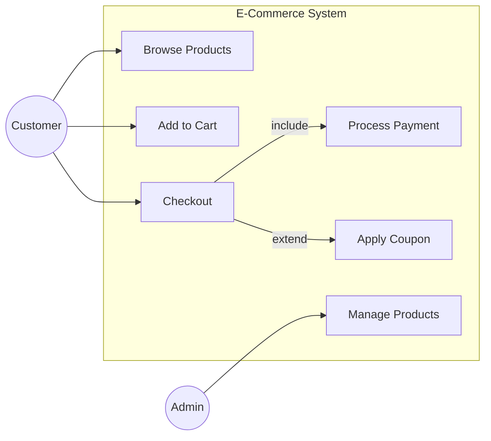

### Common Mistakes

- ❌ Too many use cases — keep them high-level (goals, not steps)
- ❌ Modeling UI flows instead of user goals
- ❌ Confusing `<<include>>` and `<<extend>>`
- ❌ Putting implementation details inside use cases
- ✅ Use verb + noun naming: "Place Order", "Register Account", "Track Shipment"

---

## 3. Class Diagrams

### Definition

**Class Diagrams** are structural UML diagrams that model the static structure of an object-oriented system. They show **classes** (blueprints for objects), their **attributes** (data), **methods** (behavior), and the **relationships** between them. Class diagrams serve as the bridge between OOP design and actual code — they directly map to classes, interfaces, and database tables.

### Class Notation

```
┌─────────────────────────────────────────────────────────────────────┐
│                    CLASS NOTATION                                   │
│                                                                     │
│   ┌──────────────────────────┐                                      │
│   │         ClassName        │  ← Class name (bold, centered)       │
│   ├──────────────────────────┤                                      │
│   │ - privateAttr : String   │  ← Attributes (visibility name:type) │
│   │ # protectedAttr : int    │                                      │
│   │ + publicAttr : bool      │                                      │
│   ├──────────────────────────┤                                      │
│   │ + publicMethod() : void  │  ← Methods (visibility name():return)│
│   │ - privateMethod() : int  │                                      │
│   │ + static() : String      │  ← Static: underlined                │
│   └──────────────────────────┘                                      │
│                                                                     │
│   Visibility:  + public   - private   # protected   ~ package       │
│                                                                     │
│   Abstract class: name in italics or {abstract} stereotype          │
│   Interface:      <<interface>> stereotype at top                   │
│   Enumeration:    <<enumeration>> stereotype at top                 │
└─────────────────────────────────────────────────────────────────────┘
```

### Relationships

**Definition:** Relationships define how classes interact with each other. The main types are **Association** (generic link), **Inheritance** (is-a), **Aggregation** (has-a, weak ownership), **Composition** (has-a, strong ownership), and **Dependency** (uses-a).

```
┌─────────────────────────────────────────────────────────────────────┐
│                   CLASS DIAGRAM RELATIONSHIPS                       │
├─────────────────────────────────────────────────────────────────────┤
│                                                                     │
│  ASSOCIATION — "uses" / "knows about"                               │
│  ClassA ──────────────────────────────► ClassB                      │
│  (solid line, optional arrow for direction)                         │
│                                                                     │
│  AGGREGATION — "has-a" (parts can exist independently)              │
│  Whole ◇──────────────────────────────── Part                       │
│  (hollow diamond on the "whole" side)                               │
│  Example: Department ◇──── Employee                                 │
│                                                                     │
│  COMPOSITION — "owns" (parts cannot exist without whole)            │
│  Whole ◆──────────────────────────────── Part                       │
│  (filled diamond on the "whole" side)                               │
│  Example: House ◆──── Room                                          │
│                                                                     │
│  INHERITANCE — "is-a" (subclass extends superclass)                 │
│  Superclass ◁────────────────────────── Subclass                    │
│  (solid line, hollow triangle pointing to parent)                   │
│  Example: Animal ◁──── Dog                                          │
│                                                                     │
│  REALIZATION — class implements interface                           │
│  Interface ◁- - - - - - - - - - - - - - ConcreteClass               │
│  (dashed line, hollow triangle pointing to interface)               │
│                                                                     │
│  DEPENDENCY — "depends on" (temporary usage)                        │
│  ClassA - - - - - - - - - - - - - - - ► ClassB                      │
│  (dashed arrow — weakest relationship)                              │
│                                                                     │
└─────────────────────────────────────────────────────────────────────┘
```

### Relationship Types Reference

| Relationship | Description | UML Notation |
|--------------|-------------|--------------|
| **Association** | Generic "uses" or "knows about" | Solid line (`──>`) |
| **Inheritance** | "Is-a" relationship (extends) | Solid line, hollow triangle (`──▷`) |
| **Realization** | Implements an interface | Dashed line, hollow triangle (`- -▷`) |
| **Dependency** | Use (weak connection) | Dashed line, arrow (`- - >`) |
| **Aggregation** | "Has-a" (weak ownership) | Solid line, hollow diamond (`◇──`) |
| **Composition** | "Owns" (strong ownership) | Solid line, filled diamond (`◆──`) |

### Multiplicity / Cardinality


**Definition:** Multiplicity defines how many instances of one class can be associated with instances of another class. Common notations include `1` (exactly one), `0..1` (zero or one), `*` (many), and `1..*` (one or more).

| Notation | Meaning | Example |
|----------|---------|---------|
| `1` | Exactly one | One order has one customer |
| `0..1` | Zero or one | A user may have one profile |
| `*` or `0..*` | Zero or more | A post has zero or more comments |
| `1..*` | One or more | An order has at least one item |
| `n..m` | Specific range | A team has 2..11 players |

### Practical Example — Blog System


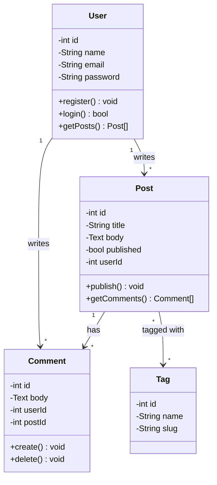

### Mapping to PHP Code

**Definition:** UML Class diagrams map directly to PHP code structure. A class box becomes a `class {}` block, attributes become properties (`public $name;`), operations become methods (`function getName()`), and relationships become property references or inheritance (`extends`).

```php
// Class diagram → PHP class
class User {
    private int $id;
    private string $name;
    private string $email;

    public function register(): void { /* ... */ }
    public function login(): bool { /* ... */ }

    // 1..* relationship → hasMany
    public function getPosts(): array { /* ... */ }
}

class Post {
    private int $id;
    private string $title;
    private int $userId; // FK → User

    public function publish(): void { /* ... */ }
}
```

### Common Mistakes

- ❌ Too much detail — keep it design-level, not implementation-level
- ❌ Missing multiplicity on relationships
- ❌ Confusing aggregation (◇) and composition (◆)
- ❌ Not showing key methods, only attributes
- ✅ Show only the most important attributes and methods
- ✅ Always label relationships with multiplicity

---

## 4. Entity-Relationship Diagrams (ERD)

### Definition

**Entity-Relationship Diagrams (ERDs)** are structural diagrams used to model the **database schema** of a system. They show **entities** (tables), their **attributes** (columns), and the **relationships** between them (foreign keys, join tables). ERDs use Crow's Foot notation in most modern tools and directly map to SQL `CREATE TABLE` statements and ORM model definitions.

### ERD vs Class Diagram

| | ERD | Class Diagram |
|--|-----|---------------|
| **Focus** | Database structure | OOP design |
| **Elements** | Tables, columns, FK | Classes, attributes, methods |
| **Relationships** | 1:1, 1:N, M:N | Association, Inheritance, etc. |
| **Methods** | ❌ No methods | ✅ Has methods |
| **Used for** | Database design | Code design |

### Crow's Foot Notation

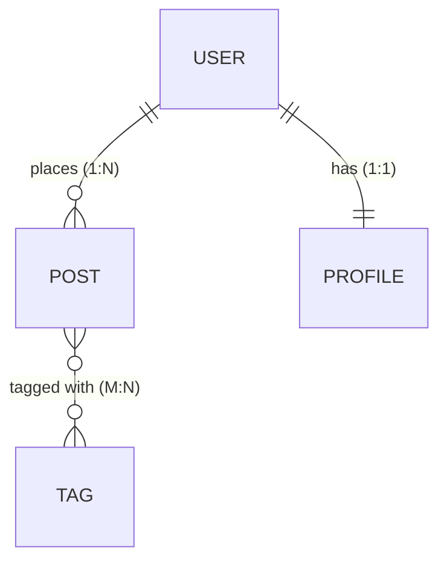

### Attribute Types

| Symbol | Meaning |
|--------|---------|
| **PK** | Primary Key — unique identifier |
| **FK** | Foreign Key — references another table |
| **UK** | Unique Key — must be unique, not PK |
| `NOT NULL` | Required field |
| `NULL` | Optional field |

### Practical Example — E-Commerce ERD


```mermaid
erDiagram
    users {
        int id PK
        string name
        string email
        string password
        timestamp created_at
    }

    orders {
        int id PK
        int user_id FK
        decimal total
        string status
        timestamp created_at
    }

    order_items {
        int id PK
        int order_id FK
        int product_id FK
        int quantity
        decimal unit_price
    }

    products {
        int id PK
        string name
        decimal price
        int stock
        int category_id FK
    }

    categories {
        int id PK
        string name
        string slug
    }

    users ||--o{ orders : "places"
    orders ||--|{ order_items : "contains"
    products ||--o{ order_items : "included in"
    categories ||--o{ products : "has"
```

### Mapping ERD to SQL

**Definition:** An Entity Relationship Diagram (ERD) maps directly to a relational database schema. Entities become tables, attributes become columns, relationships become foreign keys, and multiplicity determines constraints (like `UNIQUE` or `NOT NULL`).

```sql
-- ERD entity → SQL table
CREATE TABLE users (
    id          INT PRIMARY KEY AUTO_INCREMENT,
    name        VARCHAR(100) NOT NULL,
    email       VARCHAR(150) NOT NULL UNIQUE,
    password    VARCHAR(255) NOT NULL,
    created_at  TIMESTAMP DEFAULT CURRENT_TIMESTAMP
);

CREATE TABLE orders (
    id          INT PRIMARY KEY AUTO_INCREMENT,
    user_id     INT NOT NULL,
    total       DECIMAL(10,2) NOT NULL,
    status      ENUM('pending','paid','shipped','delivered') DEFAULT 'pending',
    created_at  TIMESTAMP DEFAULT CURRENT_TIMESTAMP,
    FOREIGN KEY (user_id) REFERENCES users(id) ON DELETE CASCADE
);

CREATE TABLE order_items (
    id          INT PRIMARY KEY AUTO_INCREMENT,
    order_id    INT NOT NULL,
    product_id  INT NOT NULL,
    quantity    INT NOT NULL DEFAULT 1,
    unit_price  DECIMAL(10,2) NOT NULL,
    FOREIGN KEY (order_id)   REFERENCES orders(id)   ON DELETE CASCADE,
    FOREIGN KEY (product_id) REFERENCES products(id) ON DELETE RESTRICT
);
```

### Mapping ERD to Laravel Migrations

**Definition:** ERDs guide the creation of Laravel migrations. Each entity corresponds to a migration file (`create_users_table`). Attributes map to schema methods (`$table->string('email')`), and relationships are defined using foreign key constraints (`$table->foreignId('user_id')`).

```php
// ERD entity → Laravel migration
Schema::create('orders', function (Blueprint $table) {
    $table->id();
    $table->foreignId('user_id')->constrained()->cascadeOnDelete();
    $table->decimal('total', 10, 2);
    $table->enum('status', ['pending', 'paid', 'shipped', 'delivered'])
          ->default('pending');
    $table->timestamps();
});

// Many-to-many pivot table
Schema::create('post_tag', function (Blueprint $table) {
    $table->foreignId('post_id')->constrained()->cascadeOnDelete();
    $table->foreignId('tag_id')->constrained()->cascadeOnDelete();
    $table->primary(['post_id', 'tag_id']);
});
```

### Normalization Quick Reference

| Normal Form | Rule | Problem it Solves |
|-------------|------|-------------------|
| **1NF** | Atomic values, no repeating groups | Duplicate columns |
| **2NF** | 1NF + no partial dependencies (all non-key cols depend on full PK) | Redundant data in composite PKs |
| **3NF** | 2NF + no transitive dependencies (non-key cols don't depend on other non-key cols) | Update anomalies |

### Common ERD Mistakes

- ❌ Missing foreign keys — relationships implied but not shown
- ❌ Not normalizing — storing redundant data (e.g., category name in every product row)
- ❌ Over-normalizing — creating unnecessary joins for simple data
- ❌ Inconsistent naming (mixing `userId`, `user_id`, `UserID`)
- ✅ Use consistent snake_case for column names
- ✅ Always define data types and constraints
- ✅ Resolve every M:N relationship with a pivot table

---

## 5. Sequence Diagrams

### Definition

**Sequence Diagrams** are behavioral UML diagrams that show how objects or components **interact over time** to accomplish a specific task. They depict the sequence of messages exchanged between participants (actors, systems, services) in chronological order from top to bottom. Sequence diagrams are ideal for documenting API flows, authentication processes, and complex multi-step operations.

### Elements

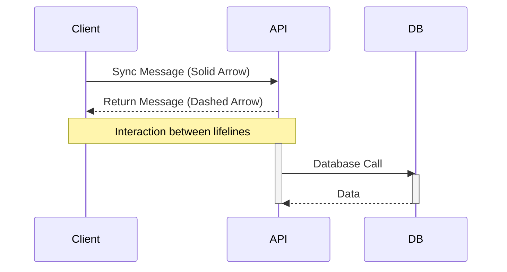

### Practical Example — User Login Flow


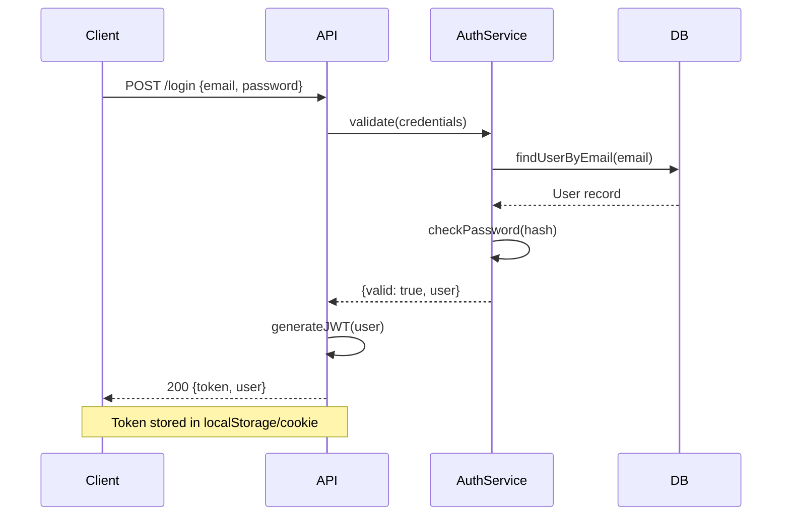

### Common Use Cases for Sequence Diagrams

| Scenario | What to Model |
|----------|---------------|
| **Authentication** | Login, OAuth, JWT refresh |
| **API calls** | Request → Middleware → Controller → Service → DB → Response |
| **Payment flow** | Cart → Checkout → Payment gateway → Confirmation |
| **WebSocket** | Connection, message broadcast, disconnect |
| **Queue/Jobs** | Dispatch → Queue → Worker → Notification |

---

## 6. UML Best Practices

### Definition

**UML Best Practices** are guidelines for creating diagrams that are clear, purposeful, and maintainable. Good UML diagrams communicate intent efficiently — they are not exhaustive documentation of every detail, but focused models that answer specific questions about the system's design or behavior.

### General Guidelines

| Principle | Guidance |
|-----------|----------|
| **Purpose first** | Know what question the diagram answers before drawing |
| **Right level of detail** | Design-level, not implementation-level |
| **Consistency** | Use the same notation throughout |
| **Keep it simple** | One diagram per concern; split complex diagrams |
| **Label everything** | Name relationships, add multiplicity, use clear names |
| **Use tools** | Mermaid for docs, draw.io for presentations |

### Choosing the Right Diagram

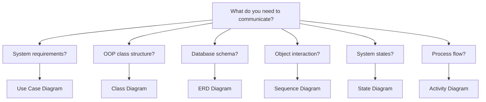

### Mermaid Quick Reference

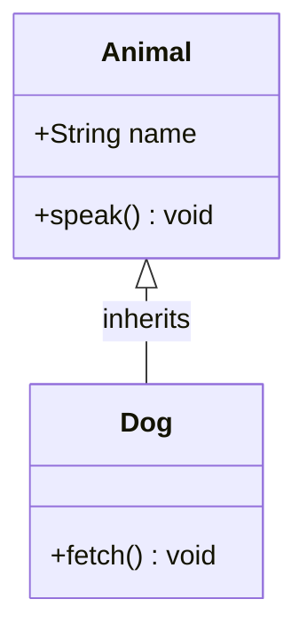

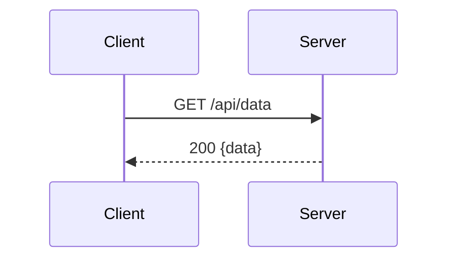

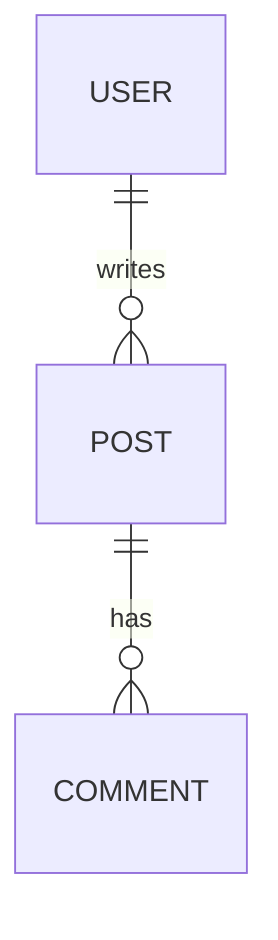

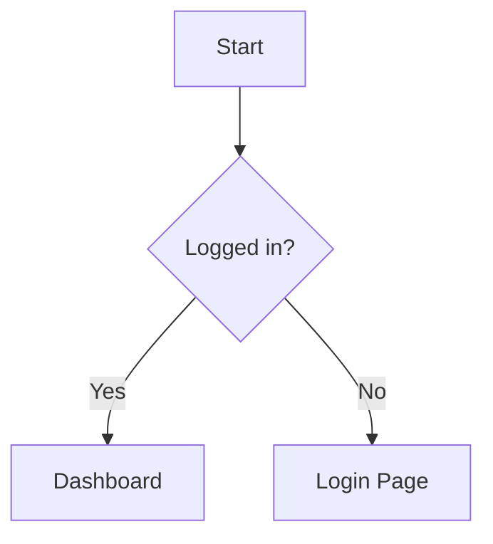

### DO's ✅ and DON'Ts ❌

**DO's:**
- Use diagrams to communicate, not to document everything
- Keep class diagrams at design level (not every getter/setter)
- Use Mermaid for diagrams that live alongside code in Markdown
- Validate ERDs against actual migrations before finalizing
- Show multiplicity on every relationship in class/ERD diagrams

**DON'Ts:**
- Don't create diagrams nobody reads — keep them up to date or delete them
- Don't put implementation details in use case diagrams
- Don't confuse aggregation (◇) and composition (◆)
- Don't skip the system boundary in use case diagrams
- Don't model every class — focus on the core domain

---

## 🔑 Key Takeaways

| Diagram | Purpose | Key Elements |
|---------|---------|--------------|
| **Use Case** | What the system does | Actors, use cases, include/extend |
| **Class** | OOP structure | Classes, attributes, methods, relationships |
| **ERD** | Database schema | Entities, attributes, FK, cardinality |
| **Sequence** | Interaction over time | Participants, messages, lifelines |

**Relationship cheat sheet:**
- `──────────►` Association (uses/knows)
- `◇──────────` Aggregation (has-a, parts independent)
- `◆──────────` Composition (owns, parts dependent)
- `◁──────────` Inheritance (is-a)
- `◁- - - - -` Realization (implements)
- `- - - - - ►` Dependency (depends on)
