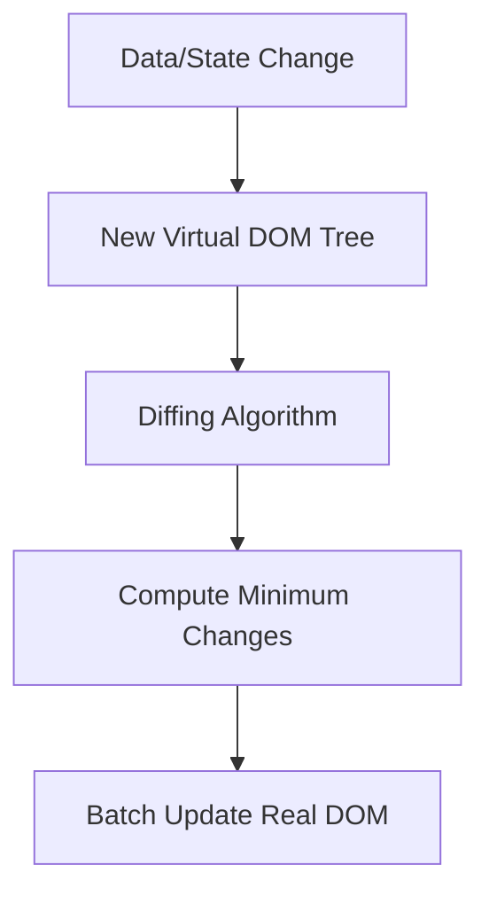

# ⚛️ React.js - The Library for Web and Native User Interfaces

## Summary

This comprehensive document covers React.js, from foundational concepts to advanced patterns and the modern ecosystem. Topics include JSX, the Virtual DOM, Component architecture (Functional & Class), State Management with Hooks (useState, useEffect, useReducer, useContext), Performance optimization (useMemo, useCallback), Advanced Patterns (HOCs, Render Props), Error Boundaries, Portals, and an overview of the modern ecosystem including Next.js, TanStack Query, and State Management libraries like Redux Toolkit and Zustand.

## Sommaire

- [1. Introduction](#1-introduction)
  - [What is React?](#what-is-react)
  - [Key Philosophy](#key-philosophy)
  - [Virtual DOM & Reconciliation](#virtual-dom-&-reconciliation)
  - [React vs Angular vs Vue](#react-vs-angular-vs-vue)
- [2. Basic Concepts](#2-basic-concepts)
  - [JSX (JavaScript XML)](#jsx-javascript-xml)
  - [Components: Functional vs Class](#components-functional-vs-class)
  - [Props: Passing Data](#props-passing-data)
- [3. State Management & Hooks](#3-state-management-&-hooks)
  - [The Power of Hooks](#the-power-of-hooks)
  - [useState: Core State](#usestate-core-state)
  - [useEffect: Side Effects](#useeffect-side-effects)
  - [useContext: Avoiding Prop Drilling](#usecontext-avoiding-prop-drilling)
  - [useReducer: Complex State Logic](#usereducer-complex-state-logic)
  - [useRef: Accessing DOM and Values](#useref-accessing-dom-and-values)
- [4. Performance Optimization](#4-performance-optimization)
  - [useMemo & useCallback](#usememo-&-usecallback)
  - [React.memo](#reactmemo)
  - [Code Splitting with lazy & Suspense](#code-splitting-with-lazy-&-suspense)
- [5. Advanced Patterns](#5-advanced-patterns)
  - [Higher-Order Components (HOC)](#higher-order-components-hoc)
  - [Render Props](#render-props)
  - [Custom Hooks](#custom-hooks)
- [6. Portals, Fragments & Error Boundaries](#6-portals-fragments-&-error-boundaries)
  - [Fragments](#fragments)
  - [Portals](#portals)
  - [Error Boundaries](#error-boundaries)
- [7. Handling Forms & Events](#7-handling-forms-&-events)
  - [Controlled vs Uncontrolled Components](#controlled-vs-uncontrolled-components)
  - [Synthetic Events](#synthetic-events)
- [8. Routing (React Router v6+)](#8-routing-react-router-v6+)
- [9. Modern Ecosystem](#9-modern-ecosystem)
  - [Next.js: The Production Framework](#nextjs-the-production-framework)
  - [Data Fetching: TanStack Query](#data-fetching-tanstack-query)
  - [State Management: Redux vs Zustand](#state-management-redux-vs-zustand)
  - [Styling: Tailwind & Styled Components](#styling-tailwind-&-styled-components)
- [10. Testing React Applications](#10-testing-react-applications)
- [11. Best Practices & Pitfalls](#11-best-practices-&-pitfalls)

---

## 1. Introduction

**Definition:** React is an open-source JavaScript library developed by Meta (formerly Facebook) for building user interfaces. It follows a declarative, component-based approach and uses a Virtual DOM to optimize rendering performance.

### What is React?

React is not a full-featured framework like Angular; it's a library focused on the **View** layer. It allows developers to create reusable UI components that manage their own state.

**Key Features:**
- **Declarative:** You describe what the UI should look like for a given state, and React handles the updates.
- **Component-Based:** Large UIs are broken down into small, independent pieces.
- **Unidirectional Data Flow:** Data flows down from parent to child via props.

### Virtual DOM & Reconciliation

**Definition:** The Virtual DOM is a lightweight copy of the real DOM. When state changes, React creates a new Virtual DOM tree, compares it with the previous one (Diffing), and updates only the changed parts in the real DOM (Reconciliation).



### React vs Angular vs Vue

| Feature | React | Vue | Angular |
|---------|-------|-----|---------|
| Architecture | Library (View) | Progressive Framework | Full Framework (MVC) |
| Learning Curve | Medium | Low | High |
| Templating | JSX (JS-centric) | HTML-based | TypeScript + HTML |
| Data Binding | One-way | Two-way | Two-way |
| Performance | High (VDOM) | High (VDOM/Reactive) | High (Real DOM + Ivy) |

---

## 2. Basic Concepts

### JSX (JavaScript XML)

**Definition:** JSX is a syntax extension that allows writing HTML-like code inside JavaScript. It's transformed into `React.createElement()` calls by transpilers like Babel.

```jsx
// JSX
const element = <h1 className="title">Hello World</h1>;

// Compiled JS
const element = React.createElement('h1', {className: 'title'}, 'Hello World');
```

**Rules of JSX:**
- Return a single root element (or use `<React.Fragment>` / `<>`).
- Use `camelCase` for attributes (`className`, `onClick`, `tabIndex`).
- JavaScript expressions go inside `{ }`.

### Components: Functional vs Class

**Functional Components (Modern):**
```jsx
const MyComponent = ({ name }) => {
  return <div>Hello, {name}</div>;
};
```

**Class Components (Legacy):**
```jsx
class MyComponent extends React.Component {
  render() {
    return <div>Hello, {this.props.name}</div>;
  }
}
```

---

## 3. State Management & Hooks

### The Power of Hooks

**Definition:** Hooks are functions that let you "hook into" React state and lifecycle features from function components. Introduced in React 16.8.

### useState: Core State

```jsx
const [state, setState] = useState(initialValue);
```

**Example:**
```jsx
function Counter() {
  const [count, setCount] = useState(0);
  return <button onClick={() => setCount(prev => prev + 1)}>{count}</button>;
}
```

### useEffect: Side Effects

**Definition:** Handles operations like API calls, subscriptions, and DOM manipulations.

```jsx
useEffect(() => {
  const timer = setInterval(() => console.log('Tick'), 1000);
  return () => clearInterval(timer); // Cleanup function
}, []); // Empty array = run once on mount
```

### useContext: Avoiding Prop Drilling

**Definition:** Context provides a way to pass data through the component tree without having to pass props down manually at every level.

```jsx
const UserContext = React.createContext();

function Parent() {
  return (
    <UserContext.Provider value={{ name: 'Tariq' }}>
        <Child />
    </UserContext.Provider>
  );
}

function Child() {
  const user = useContext(UserContext);
  return <div>User: {user.name}</div>;
}
```

---

## 4. Performance Optimization

### useMemo & useCallback

- **`useMemo`:** Memoizes a computed value to avoid expensive recalculations on every render.
- **`useCallback`:** Memoizes a function instance to prevent unnecessary re-renders of child components that depend on it.

```jsx
const memoizedValue = useMemo(() => expensiveCalculation(a, b), [a, b]);
const memoizedCallback = useCallback(() => doSomething(a, b), [a, b]);
```

### React.memo

**Definition:** A higher-order component that prevents a functional component from re-rendering if its props haven't changed.

---

## 5. Advanced Patterns

### Custom Hooks

**Definition:** A mechanism to reuse stateful logic between components. Custom hooks must start with `use`.

```jsx
function useFetch(url) {
  const [data, setData] = useState(null);
  useEffect(() => {
    fetch(url).then(res => res.json()).then(setData);
  }, [url]);
  return data;
}
```

---

## 6. Portals, Fragments & Error Boundaries

### Error Boundaries

**Definition:** Class components that catch JavaScript errors anywhere in their child component tree, log those errors, and display a fallback UI instead of crashing the whole app.

```jsx
class ErrorBoundary extends React.Component {
  state = { hasError: false };
  static getDerivedStateFromError(error) { return { hasError: true }; }
  render() {
    if (this.state.hasError) return <h1>Something went wrong.</h1>;
    return this.props.children;
  }
}
```

---

## 9. Modern Ecosystem

### Next.js: The Production Framework
Next.js adds features like Server-Side Rendering (SSR), Static Site Generation (SSG), and API routes on top of React.

### Data Fetching: TanStack Query
Handles caching, synchronization, and updating server state in your React applications.

---

## 11. Best Practices & Pitfalls

1.  **Don't modify state directly:** Always use the updater function.
2.  **Keep components pure:** Components should return the same UI for the same props.
3.  **Key prop is vital:** Never use array indices as keys for dynamic lists.
4.  **Avoid deep prop drilling:** Use Context or a state management library.
5.  **Clean up effects:** Always return a cleanup function in `useEffect` for timers or subscriptions.

---

## Resources
- [React Documentation](https://react.dev)
- [React Patterns](https://reactpatterns.com/)
- [Epic React by Kent C. Dodds](https://epicreact.dev/)
