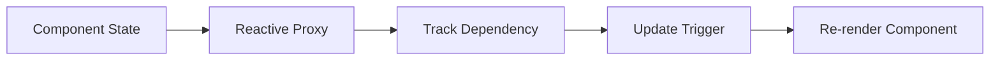

# 🖖 Vue.js - The Progressive JavaScript Framework

## Summary

This comprehensive document covers Vue.js 3, from foundational syntax and reactive concepts to advanced patterns and the modern ecosystem. Topics include Templates and Directives, the Reactivity System (ref, reactive, computed, watch), Component Architecture (SFCs, Props, Emits), the Composition API, Lifecycle Hooks, Advanced features (Teleport, Suspense), State Management with Pinia, Routing with Vue Router, and an overview of the modern ecosystem including Vite, Nuxt.js, and Vitest.

## Sommaire

- [1. Introduction](#1-introduction)
  - [What is Vue.js?](#what-is-vuejs)
  - [Key Philosophy](#key-philosophy)
  - [Reactivity System Architecture](#reactivity-system-architecture)
  - [Vue 2 vs Vue 3](#vue-2-vs-vue-3)
- [2. Basic Syntax & Directives](#2-basic-syntax-&-directives)
  - [Declarative Rendering](#declarative-rendering)
  - [Attributes Binding (v-bind)](#attributes-binding-v-bind)
  - [Conditional Rendering (v-if, v-show)](#conditional-rendering-v-if-v-show)
  - [List Rendering (v-for)](#list-rendering-v-for)
  - [Two-Way Binding (v-model)](#two-way-binding-v-model)
- [3. Component Architecture](#3-component-architecture)
  - [Single File Components (SFC)](#single-file-components-sfc)
  - [Props: Passing Data Down](#props-passing-data-down)
  - [Emits: Passing Events Up](#emits-passing-events-up)
  - [Slots: Content Distribution](#slots-content-distribution)
- [4. Composition API (Modern Vue)](#4-composition-api-modern-vue)
  - [ref vs reactive](#ref-vs-reactive)
  - [computed: Derived State](#computed-derived-state)
  - [watch: Side Effects](#watch-side-effects)
  - [Composables: Reusable Logic](#composables-reusable-logic)
- [5. Lifecycle Hooks](#5-lifecycle-hooks)
  - [Initialization & Cleanup](#initialization-&-cleanup)
- [6. Advanced Features](#6-advanced-features)
  - [Teleport: Move Components](#teleport-move-components)
  - [Suspense: Handling Async](#suspense-handling-async)
  - [Provide / Inject](#provide-inject)
- [7. Transitions & Animations](#7-transitions-&-animations)
- [8. Routing (Vue Router 4)](#8-routing-vue-router-4)
  - [Dynamic Matching](#dynamic-matching)
  - [Navigation Guards](#navigation-guards)
- [9. State Management (Pinia)](#9-state-management-pinia)
  - [Stores: State, Getters, Actions](#stores-state-getters-actions)
- [10. Modern Ecosystem](#10-modern-ecosystem)
  - [Vite: The Build Tool](#vite-the-build-tool)
  - [Nuxt.js: The Full-Stack Framework](#nuxtjs-the-full-stack-framework)
  - [Testing: Vitest & Cypress](#testing-vitest-&-cypress)
- [11. Best Practices & Pitfalls](#11-best-practices-&-pitfalls)

---

## 1. Introduction

**Definition:** Vue.js is a progressive JavaScript framework for building user interfaces. It is designed to be incrementally adoptable, meaning you can use it for small portions of a page or build full single-page applications.

### What is Vue.js?

Vue (pronounced /vjuː/, like view) is a framework that emphasizes simplicity and performance. It combines the best of Angular (templates, directives) and React (VDOM, component-based).

**Key Features:**
- **Approachable:** Familiar HTML/CSS/JS syntax.
- **Performant:** Optimized reactivity system and Virtual DOM.
- **Versatile:** Scales between a library and a full-featured framework.

### Reactivity System Architecture

**Definition:** Vue's reactivity is based on JavaScript Proxies (Vue 3). When a reactive property is modified, Vue knows exactly which components depend on it and updates the specific parts of the DOM.



### Vue 2 vs Vue 3

| Feature | Vue 2 | Vue 3 |
|---------|-------|-------|
| Root API | `new Vue()` | `createApp()` |
| Reactivity | `Object.defineProperty` | `Proxy` (Better performance) |
| Core API | Options API | Composition API + Options API |
| Multi-root | Single root required | Fragments supported |
| TypeScript | Limited support | Built with TypeScript |

---

## 2. Basic Syntax & Directives

### Directives Reference

- **`v-bind` (`:`)**: Dynamically bind an attribute.
- **`v-on` (`@`)**: Attach an event listener.
- **`v-model`**: Two-way data binding on inputs.
- **`v-if` / `v-else`**: Conditional rendering (removes element from DOM).
- **`v-show`**: Conditional visibility (toggles `display: none`).
- **`v-for`**: List rendering.

---

## 3. Component Architecture

### Single File Components (SFC)

**Definition:** A `.vue` file containing `<template>`, `<script>`, and `<style>`.

```vue
<script setup>
import { ref } from 'vue'
const count = ref(0)
</script>

<template>
  <button @click="count++">{{ count }}</button>
</template>

<style scoped>
button { color: green; }
</style>
```

---

## 4. Composition API (Modern Vue)

### ref vs reactive

- **`ref()`**: For primitive values or replacing the entire object. Access via `.value` in logic, but unwrapped in templates.
- **`reactive()`**: For objects or arrays. Deeply reactive, but cannot hold primitive values.

### Composables: Reusable Logic

**Definition:** A function that leverages the Composition API to encapsulate stateful logic.

```javascript
// useMouse.js
export function useMouse() {
  const x = ref(0)
  const y = ref(0)
  // ... window.addEventListener('mousemove', (e) => { x.value = e.pageX; y.value = e.pageY; })
  return { x, y }
}
```

---

## 6. Advanced Features

### Teleport: Move Components

**Definition:** Allows you to "teleport" a component's template into a different part of the DOM, such as a modal to the bottom of the `<body>`.

```html
<Teleport to="body">
    <div class="modal">Hello from body!</div>
</Teleport>
```

### Suspense: Handling Async

**Definition:** Handles asynchronous dependencies (like async `setup()`) by showing a fallback while the component loads.

---

## 9. State Management (Pinia)

**Definition:** Pinia is the modern successor to Vuex. It is intuitive, type-safe, and lacks the boilerplate of Vuex (no more mutations).

```javascript
export const useUserStore = defineStore('user', () => {
  const name = ref('Tariq')
  const logout = () => name.value = ''
  return { name, logout }
})
```

---

## 11. Best Practices & Pitfalls

1.  **Always use `:key` with `v-for`:** Vital for the diffing algorithm.
2.  **Use `<script setup>`:** It's more concise and performant.
3.  **Scoped Styles:** Always use `scoped` to prevent CSS leaking.
4.  **Avoid complex logic in templates:** Use computed properties instead.
5.  **Don't use `v-if` and `v-for` on the same element:** High performance cost; use computed properties to filter lists first.

---

## Resources
- [Official Vue Documentation](https://vuejs.org/)
- [Vite Guide](https://vitejs.dev/)
- [Nuxt.js Docs](https://nuxt.com/)
- [Pinia Docs](https://pinia.vuejs.org/)
